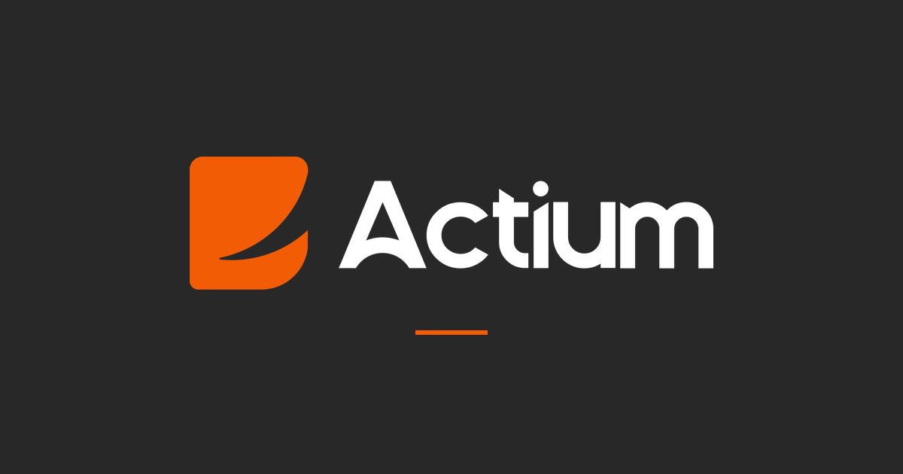
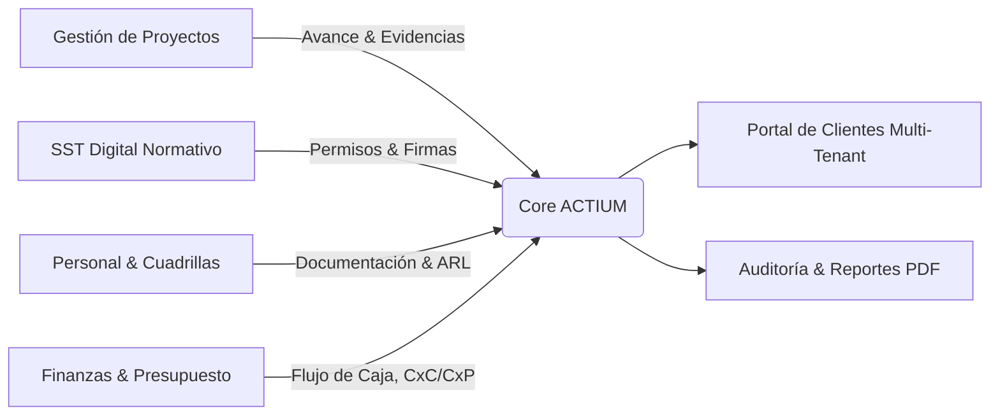

# ACTIUM — Infraestructura y Activos

<div align="center">



**Plataforma Empresarial Integral para la Gestión de Proyectos Metalmecánicos, Operaciones en Campo, SST y Control Financiero**

[](https://nextjs.org/)
[](https://www.typescriptlang.org/)
[](https://tailwindcss.com/)
[](https://supabase.com/)
[](https://www.framer.com/motion/)
[](LICENSE)

[Visión General](#-visión-general-y-contexto-de-negocio) •
[Módulos del Sistema](#-módulos-del-sistema) •
[Arquitectura Técnica](#-arquitectura-técnica) •
[Seguridad y Multi-Tenancy](#-seguridad-y-multi-tenancy-rls) •
[Guía de Instalación](#-instalación-y-configuración-local) •
[Despliegue](#-despliegue-y-mantenimiento)

</div>

---

## 🏗️ Visión General y Contexto de Negocio

**Actium — Infraestructura y Activos** cuenta con más de 16 años de trayectoria en el sector industrial y metalmecánico colombiano, especializándose en la fabricación, instalación y montaje de estructuras pesadas, tanques de almacenamiento y sistemas de tuberías en acero.

### El Desafío Operativo
Las operaciones de ingeniería e infraestructura enfrentan tradicionalmente cuatro grandes fricciones operativas:
1. **Seguimiento Disperso:** Desconexión entre los avances físicos reportados en campo y la visibilidad ejecutiva en tiempo real para clientes y directores de obra.
2. **Carga Administrativa y Riesgo en SST:** Diligenciamiento de permisos de alto riesgo en papel (alturas, caliente, ATS), con alto riesgo de pérdida de trazabilidad legal ante entidades regulatorias (MinTrabajo, ARL) y demoras en el inicio de labores críticas.
3. **Desviación Presupuestal y Flujo de Caja:** Falta de control granular sobre rubros de proyecto, sobrecostos imprevistos y falta de sincronía entre facturación (CxC), compras a proveedores (CxP) y flujo de caja real.
4. **Gobierno de Múltiples Clientes y Subcontratistas:** Necesidad de compartir información selectiva y confidencial con clientes corporativos y sus respectivas filiales sin comprometer la seguridad de datos.

### La Solución ACTIUM
ACTIUM es un ecosistema SaaS/ERP modular diseñado con estándares de ingeniería de software modernos que digitaliza el ciclo de vida completo de cada proyecto:



---

## 📦 Módulos del Sistema

### 1. 📊 Portal Ejecutivo y Gestión de Proyectos
* **Curvas de Avance (Curva S):** Visualización comparativa de avance real vs. proyectado (planificado), con métricas acumuladas, semanales y diarias impulsadas por Recharts.
* **Bitácora y Partes Diarios:** Registro diario de novedades, cuadrillas en turno, condiciones climáticas y bitácora técnica con marcas de tiempo inmutables.
* **Galería Fotográfica Probatoria:** Carga múltiple de evidencias fotográficas en alta resolución con visor Lightbox mobile-first, zoom interactivo y metadatos de captura.
* **Observaciones y Gestión de Cambios:** Hilos de notas técnicas clasificados por nivel de criticidad accesibles según el rol del usuario.

### 2. 🦺 SST Digital (Seguridad y Salud en el Trabajo)
Digitalización rigurosa de los formatos de seguridad industrial exigidos por la normativa colombiana (**Resolución 1409 de 2012** / normativas de trabajo en alturas y tareas de alto riesgo):

| Formato | Finalidad Operativa | Capacidades Clave |
|---|---|---|
| **ATS (Análisis de Trabajo Seguro)** | Evaluación previa de peligros y controles por paso | Matriz de riesgos, tabla dinámica de cuadrilla ejecutora, verificación de herramientas y EPP. |
| **Permiso de Trabajo en Altura** | Autorización formal para labores sobre 1.50 m | Lista de verificación de 28 puntos normativos, inspección de sistemas anticaídas, verificación de certificaciones y ARL. |
| **Permiso de Trabajo en Caliente** | Labores de soldadura, oxicorte y chispas | Bloqueo de energías peligrosas (LOTO), verificación de atmósfera/extintores y **sistema de firmas duales** (apertura y cierre de labor). |
| **Gestión de Incidentes y Ausentismos** | Control epidemiológico y accidentes | Reporte inmediato, clasificación de gravedad, soporte documental y soft-delete auditable. |

* **Motor de Firmas y PDF:** Captura de firma digital manuscrita en canvas (`react-signature-canvas`) con advertencia legal (**Ley 527 de 1999**) y renderizado vectorial de documentos listos para imprimir mediante `@react-pdf/renderer`.

### 3. 👷 Personal de Campo (Field Workers)
* **Expediente Digital del Trabajador:** Hoja de vida técnica, roles operativos (soldador 6G, tubero, pailero, vigía SST).
* **Matriz de Conformidad Documental:** Control de vigencias de ARL, EPS, Cédula, Exámenes Médicos Ocupacionales y Certificados de Alturas con alertas por vencimiento.
* **Control de Asistencia en Tiempo Real:** Registro de check-in/check-out diario por frente de trabajo con drill-down a documentación en un clic.

### 4. 💰 Control Financiero, Presupuesto y Flujo de Caja
* **Estructura de Rubros y Techos:** Asignación presupuestal por ítems (Materiales, Mano de Obra, Equipos, Subcontratos) con control estricto de techos y autorización de sobregiros supervisada.
* **Cuentas por Cobrar (CxC):** Registro de actas de cobro, facturación a clientes, planes de cuotas, trazabilidad de cobros parciales/totales y soporte de comprobantes.
* **Cuentas por Pagar (CxP):** Gestión de compras a proveedores, órdenes de servicio, cuotas programadas y control de pagos.
* **Flujo de Caja Dinámico:** Proyección quincenal y mensual consolidada. La anulación de facturas revierte automáticamente los movimientos de tesorería preservando la integridad del balance.

---

## 🏛️ Arquitectura Técnica

La plataforma está construida sobre un stack fullstack reactivo y tipado de punta a punta:

```
ACTIUM Architecture
├── Frontend (Next.js 14 App Router)
│   ├── Server Components (RSC) para carga optimizada y SEO
│   ├── Server Actions para mutaciones transaccionales y revalidación
│   ├── Tailwind CSS + Design Tokens corporativos ACTIUM
│   ├── Framer Motion para micro-interacciones de nivel SaaS
│   └── @react-pdf/renderer para generación de PDFs en servidor/cliente
│
├── Capa de Datos y Autenticación (Supabase / PostgreSQL)
│   ├── Multi-Tenancy nativo por Empresa y Subempresa
│   ├── Row Level Security (RLS) en el 100% de las tablas
│   ├── Custom Access Token Hook inyectando claims de sesión
│   ├── Triggers y Funciones PL/pgSQL transaccionales
│   └── 6 Buckets de Storage aislados por Tenant
│
└── Infraestructura y CI/CD
    ├── Vercel Edge Network
    └── Supabase Managed Cloud (us-east-1)
```

### Stack de Tecnologías

| Capa | Herramienta | Versión | Propósito |
|---|---|---|---|
| **Framework** | Next.js (App Router) | `14.2.28` | SSR, React Server Components, Server Actions |
| **Lenguaje** | TypeScript | `^5.0.0` | Tipado estricto de base de datos y lógica de negocio |
| **Estilos** | Tailwind CSS | `^3.4.1` | Sistema de diseño basado en variables semánticas |
| **Animaciones** | Framer Motion | `^12.10.5` | Transiciones fluidas, modales y navegación viva |
| **Base de Datos** | PostgreSQL (Supabase) | `15.x` | Base de datos relacional con RLS |
| **ORM / Cliente** | `@supabase/ssr` | `^0.6.1` | Gestión de cookies, sesiones y queries seguras |
| **Motor PDF** | `@react-pdf/renderer` | `^4.5.1` | Generación de certificados y formularios oficiales |
| **Gráficas** | Recharts | `^2.15.3` | Dashboards analíticos y visualización de Curva S |

---

## 🛡️ Seguridad y Multi-Tenancy (RLS)

El sistema implementa aislamiento estricto de datos con una jerarquía de entidades:

```
[Empresa Matriz]
      └── [Subempresa / Filial]
                └── [Usuarios Asignados]
                          └── [Proyectos & Activos]
```

### Matriz de Control de Acceso (RBAC)

| Rol | Alcance de Visibilidad | Permisos de Escritura |
|---|---|---|
| `SUPER_ADMIN` | Global (todas las empresas y proyectos) | Total (Gestión de empresas, auditoría, configuración) |
| `ADMIN` | Toda la Empresa asignada | Administración de proyectos, usuarios y finanzas de su empresa |
| `CLIENTE_PRINCIPAL` | Empresa asignada (vista ejecutiva) | Lectura de reportes, curvas de avance y evidencias |
| `SUBCLIENTE` | Únicamente su Subempresa asignada | Lectura restringida de proyectos específicos |
| `SST` | Proyectos asignados | Creación/firma de ATS, permisos de altura/caliente, incidentes |
| `OPERATIVO` | Proyecto asignado | Registro de partes diarios, novedades y fotos |
| `FINANCIERO` | Proyectos de la empresa | Control de presupuestos, aprobación de gastos, CxC y CxP |

### Custom Access Token Hook & JWT Claims
Para evitar consultas repetitivas a la base de datos en cada evaluación de políticas RLS, PostgreSQL inyecta los claims de seguridad directamente en el token JWT del usuario durante el login:

```sql
-- public.custom_access_token_hook
claims := jsonb_set(claims, '{user_role}', to_jsonb(v_usuario.rol));
claims := jsonb_set(claims, '{empresa_id}', to_jsonb(v_usuario.empresa_id));
claims := jsonb_set(claims, '{subempresa_id}', to_jsonb(v_usuario.subempresa_id));
```

Todas las tablas de negocio incluyen políticas como:
```sql
CREATE POLICY "Aislamiento por tenant" ON public.proyectos
FOR SELECT USING (
  (auth.jwt() ->> 'user_role') = 'super_admin' OR
  empresa_id = (auth.jwt() ->> 'empresa_id')::uuid
);
```

---

## 📁 Estructura del Código

```text
ACTIUM/
├── docs/                        # Documentación técnica y guías de producción
├── documents/                   # PRD, manual de identidad y especificaciones
├── public/                      # Assets estáticos, logos e iconografía
├── src/
│   ├── app/                     # Rutas y páginas (Next.js App Router)
│   │   ├── (dashboard)/         # Rutas autenticadas con Sidebar corporativo
│   │   │   ├── admin/           # Gestión de empresas, subempresas y usuarios
│   │   │   ├── finanzas/        # Presupuesto, CxC, CxP y Flujo de Caja
│   │   │   ├── field-workers/   # Gestión de personal de campo y legajos
│   │   │   ├── proyectos/       # Detalle de obra, Curva S, fotos y partes
│   │   │   ├── sst/             # Bitácora, ATS, permisos de altura y caliente
│   │   │   └── settings/        # Preferencias de cuenta y perfil
│   │   ├── login/               # Autenticación con diseño industrial
│   │   └── layout.tsx           # Configuración tipográfica y proveedores
│   ├── components/              # Componentes de UI modulares
│   │   ├── admin/               # Modales de empresa/usuario y controles
│   │   ├── dashboard/           # Sidebar, calendario y cabecera
│   │   ├── finanzas/            # Tablas de CxC/CxP, gráficos y modales
│   │   ├── projects/            # Gráficas de avance, asistencias y galería
│   │   ├── sst/                 # Formularios normativos, canvas de firma y PDFs
│   │   ├── ui/                  # Componentes base shadcn/ui estilizados
│   │   └── workers/             # Expedientes, filtros y modales de trabajadores
│   ├── lib/
│   │   ├── actions/             # Next.js Server Actions (mutaciones de BD)
│   │   ├── auth/                # Guards y resolución de roles
│   │   ├── data/                # Consultas y Data Fetching optimizado
│   │   └── supabase/            # Clientes SSR, Browser y Admin
│   └── types/                   # Definiciones de TypeScript y esquema de BD
└── supabase/
    └── migrations/              # 40+ migraciones SQL con esquema y RLS
```

---

## 🎨 Sistema de Diseño y Tokens

La interfaz sigue los lineamientos del **Manual de Marca de Actium**, fusionando robustez industrial con estética SaaS de vanguardia:

```css
:root {
  /* Marca Primaria */
  --actium-orange:       #F25C05;   /* CTAs y acentos principales */
  --actium-amber:        #F27405;   /* Badges e indicadores cálidos */
  --actium-saddle:       #8C470B;   /* Enfoques y bordes activos */
  --actium-espresso:     #592C12;   /* Cabeceras y contraste tipográfico */

  /* Superficies Dark Mode (Superficie por defecto) */
  --actium-graphite:     #282828;   /* Fondo principal */
  --actium-dim:          #424242;   /* Cards elevadas y modales */
  --actium-seashell:     #FFF5EE;   /* Tipografía clara principal */
}
```

* **Tipografía:** *Plus Jakarta Sans* (`font-display`, `font-body`) en pesos 300 a 800.
* **Componentes Táctiles:** Diseñados bajo criterio **Mobile-First** con áreas de interacción $\ge 44 \times 44\text{ px}$ para uso en campo sobre tablets y smartphones.

---

## 🚀 Instalación y Configuración Local

### 1. Prerrequisitos
* Node.js `20.x` o superior
* Gestor de paquetes `npm`
* Supabase CLI (`npx supabase`)

### 2. Clonar el Repositorio
```bash
git clone https://github.com/01REALES01/actium.git
cd actium
```

### 3. Instalar Dependencias
```bash
npm install
```

### 4. Configurar Variables de Entorno
Copia el archivo `.env.example` a `.env.local`:
```bash
cp .env.example .env.local
```

Configura tus credenciales de Supabase:
```env
NEXT_PUBLIC_SUPABASE_URL=https://tu-proyecto.supabase.co
NEXT_PUBLIC_SUPABASE_ANON_KEY=tu-anon-key-publica
SUPABASE_SERVICE_ROLE_KEY=tu-service-role-key-secreta
```

### 5. Iniciar el Entorno de Desarrollo
```bash
npm run dev
```
La aplicación estará disponible en [http://localhost:3000](http://localhost:3000).

### 6. Regenerar Tipos de Base de Datos
Si realizas cambios en el esquema de Supabase, actualiza los tipos de TypeScript con:
```bash
npm run db:types
```

---

## 🚢 Despliegue y Mantenimiento

### Despliegue en Vercel
1. Conecta el repositorio en el panel de **Vercel**.
2. Configura las tres variables de entorno (`NEXT_PUBLIC_SUPABASE_URL`, `NEXT_PUBLIC_SUPABASE_ANON_KEY`, `SUPABASE_SERVICE_ROLE_KEY`).
3. El comando de build estándar es `npm run build`.

### Migraciones de Base de Datos
Las migraciones SQL viven en `supabase/migrations/`. Para aplicarlas al proyecto remoto:
```bash
npx supabase db push
```

Para más detalles operativos sobre el ambiente productivo y el script de creación del superadministrador inicial, consulta [`docs/PRODUCCION.md`](docs/PRODUCCION.md).

---

## ⚖️ Marco Legal y Cumplimiento

* **Ley 527 de 1999 (Colombia):** Las firmas electrónicas capturadas en los formularios SST cumplen una función informativa y de control de campo dentro del sistema de gestión, acompañadas de metadatos de auditoría y estampación cronológica.
* **Resolución 1409 de 2012 / Resolución 4272 de 2021:** Cumplimiento de listas de chequeo obligatorias para trabajo seguro en alturas.

---

<div align="center">

Desarrollado con precisión técnica por **Jean Reales** ([@01REALES01](https://github.com/01REALES01)) para **Actium — Infraestructura y Activos**.

</div>
