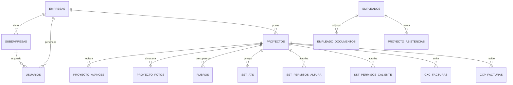

# ACTIUM — Arquitectura de Base de Datos y Supabase

Este directorio contiene el esquema completo, las políticas de seguridad a nivel de fila (RLS), funciones transaccionales y migraciones de **ACTIUM**.

---

## 🏛️ Estructura del Directorio

```text
supabase/
├── migrations/          # 40+ archivos SQL ejecutados cronológicamente
├── tests/               # Pruebas de base de datos
├── config.toml          # Configuración del CLI local de Supabase
├── seed.sql             # Datos iniciales para entorno local
└── README.md            # Esta guía
```

---

## 🗄️ Modelo de Datos y Entidades Principales

El esquema se divide en 5 grandes dominios relacionales:



### 1. Multi-Tenancy y Organización
* `public.empresas`: Empresas clientes matrices (ej. Argos, Tecnoglass).
* `public.subempresas`: Filiales o divisiones operativas con aislamiento estricto.
* `public.usuarios`: Perfiles de usuario vinculados con `auth.users` mediante triggers automáticos.

### 2. Gestión de Proyectos y Obra
* `public.proyectos`: Contratos de obra con metadatos de presupuesto, fechas y metas.
* `public.proyecto_avances`: Historial de progreso físico diario y acumulado (Curva S).
* `public.proyecto_fotos`: Registro fotográfico probatorio vinculado al storage.
* `public.proyecto_observaciones`: Notas técnicas con niveles de severidad.

### 3. Seguridad y Salud en el Trabajo (SST)
* `public.empleados`: Personal operativo con especialidades y cargos.
* `public.empleado_documentos`: Control de vigencias de ARL, EPS, cédulas y certificados de alturas.
* `public.sst_ats`: Registros de Análisis de Trabajo Seguro con pasos y peligros controlados.
* `public.sst_permisos_altura`: Formularios normativos de trabajo en alturas con firmas digitales.
* `public.sst_permisos_caliente`: Permisos de trabajos en caliente y bloqueo de energías (LOTO).
* `public.sst_incidentes` & `public.sst_ausentismos`: Trazabilidad de seguridad con soporte documental.

### 4. Módulo Financiero
* `public.rubros`: Partidas presupuestales por proyecto con techos y alertas de desviación.
* `public.rubro_movimientos`: Trazabilidad inmutable de transferencias y ajustes de presupuesto.
* `public.cxc_facturas` & `public.cxc_cuotas`: Cuentas por cobrar a clientes con cronograma de pagos.
* `public.cxp_facturas` & `public.cxp_cuotas`: Cuentas por pagar a proveedores y contratistas.
* `public.flujo_caja_movimientos`: Registro consolidado de ingresos y egresos reales.

---

## 🛡️ Seguridad: Row Level Security (RLS) y JWT Claims

Todas las tablas de negocio tienen RLS habilitado (`ENABLE ROW LEVEL SECURITY`).

### Custom Access Token Hook
Ubicado en `public.custom_access_token_hook`:
1. Cuando un usuario inicia sesión en `auth.users`, Supabase ejecuta el hook.
2. Lee el rol, `empresa_id` y `subempresa_id` de `public.usuarios`.
3. Inyecta los claims directamente en el payload del JWT:
   - `auth.jwt() ->> 'user_role'`
   - `auth.jwt() ->> 'empresa_id'`
   - `auth.jwt() ->> 'subempresa_id'`
4. Las políticas SQL evalúan estos claims de forma inmediata en memoria sin hacer joins costosos a tablas de permisos.

---

## 🪣 Buckets de Supabase Storage

| Nombre del Bucket | Visibilidad | Contenido |
|---|---|---|
| `fotos-proyectos` | Protegido (RLS) | Fotografías y evidencias de avance en campo |
| `documentos-empleados` | Privado (RLS) | PDFs de ARL, EPS, exámenes médicos y certificados |
| `firmas-sst` | Privado (RLS) | Firmas electrónicas en PNG para renderizado de PDFs |
| `comprobantes-financieros` | Privado (RLS) | Soportes de pago y comprobantes de CxC/CxP |
| `reportes-generados` | Privado (RLS) | PDFs finales de bitácoras y permisos archivados |

---

## 🛠️ Comandos de Mantenimiento

### Aplicar migraciones en Supabase remoto
```bash
npx supabase db push
```

### Resetear entorno local (con seed de prueba)
```bash
npx supabase db reset
```

### Regenerar tipos estáticos para Next.js
```bash
npm run db:types
```
